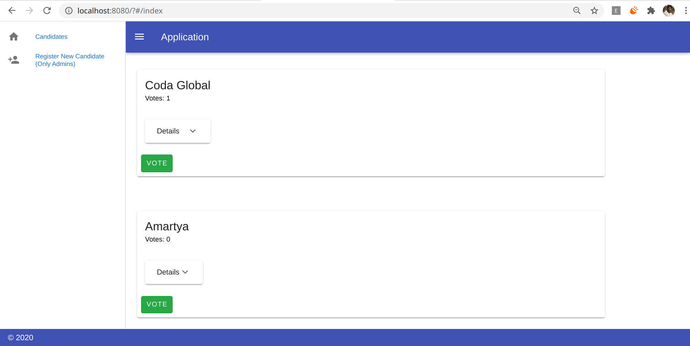
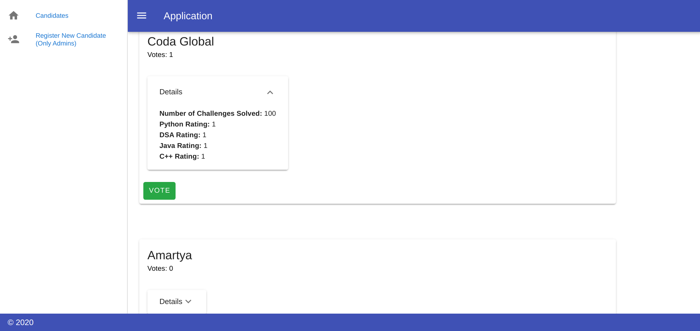
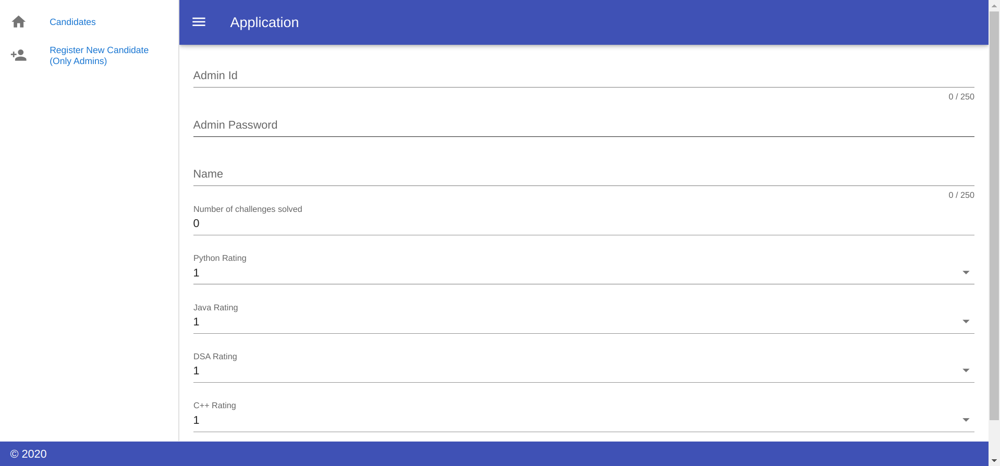
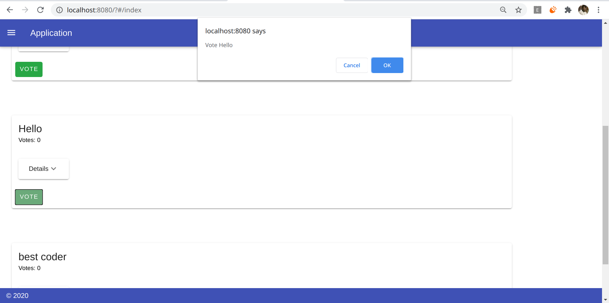

# The application details

- Admins can add candidates for voting (authenticated using basic auth)
- People can vote for a candidate
- Voting twice disabled using IP address
- CRUD REST for candidate on the endpoint: localhost:8000/api/candidate (basic auth required)
- Vote endpoint: localhost:8000/api/vote (The post request should contain the candidate_name)

Details on implementation: https://dev.to/amartyadev/a-voting-app-crud-using-django-rest-framework-and-vue-js-33d0

# Technical details

- Backend with REST APIs using Django Rest Framework
- Frontend with Vue.js

## Running the django application
- Create a virtual environment (optional)
- Install dependencies : `pip install -r requirements.txt`
- Run migration: `python manage.py migrate`
- Run the server: `python manage.py runsever`

## Run the vue app
Run the following comands from `frontend/vote-app`

- Install dependencies: `yarn install`
- Run: `yarn serve`

Look in `frontend/vote-app` for more details on same

# Screenshots:

## Index

## Detail View

## Registering candidates

## Voting

## Vote twice error (based on IP)

## Contribute
Feel free to report any issues or make the application better
